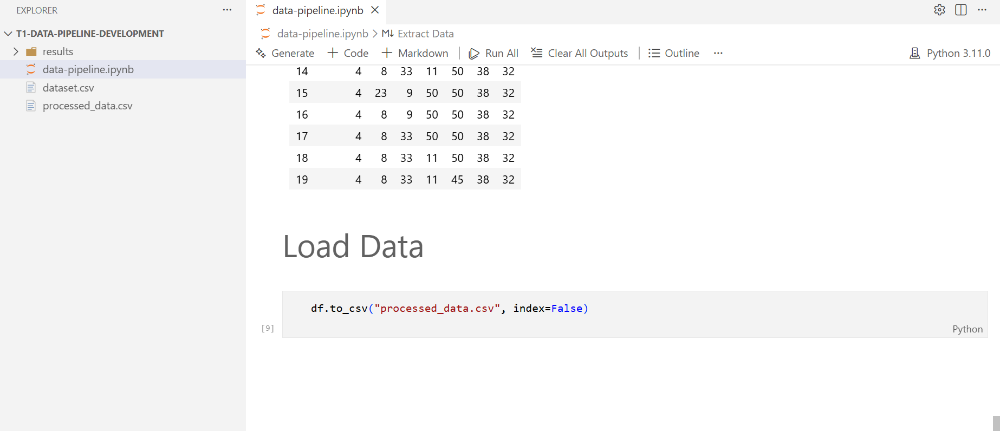
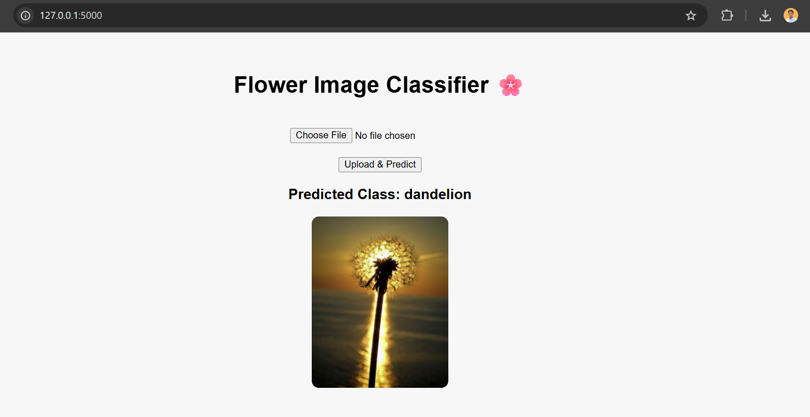
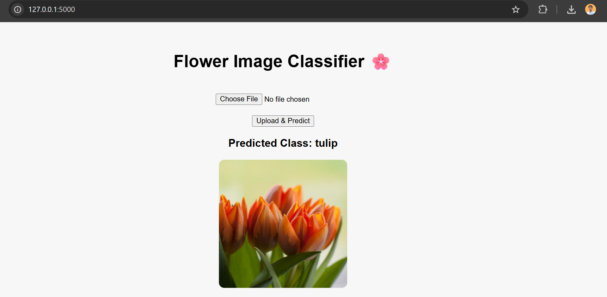
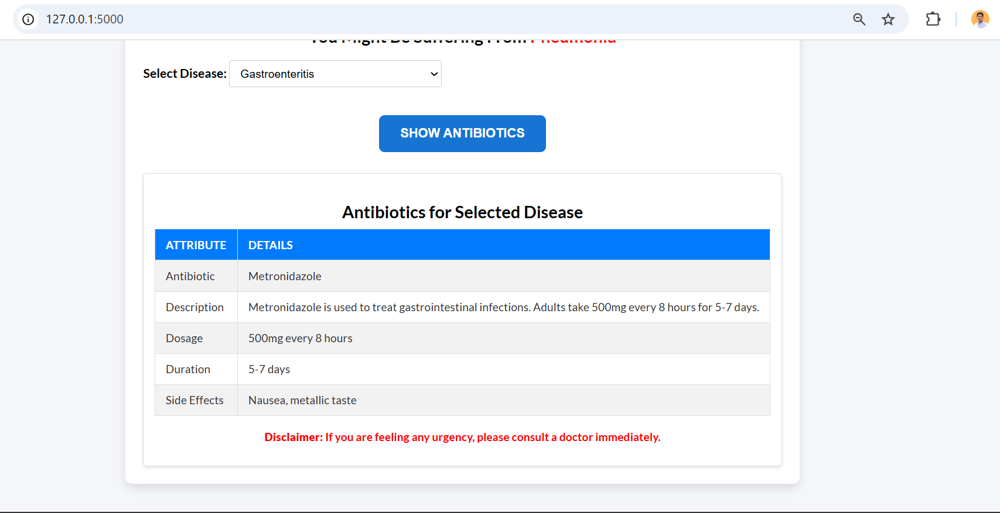
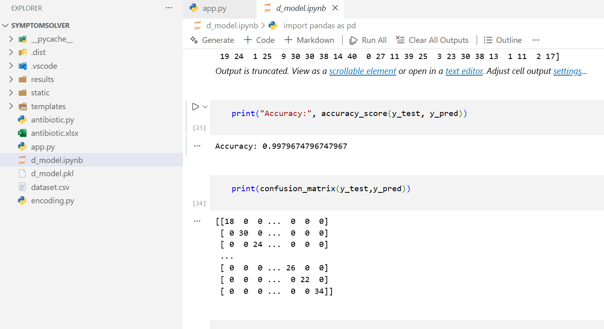
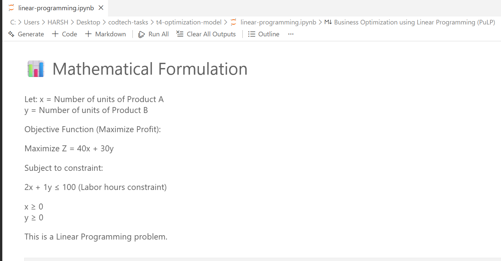
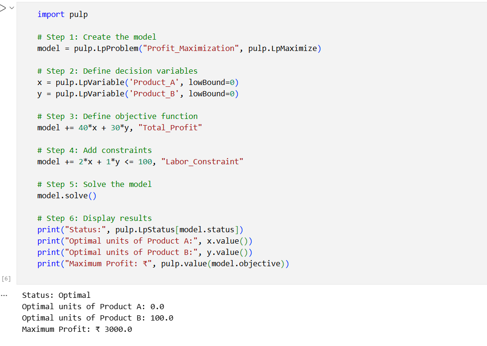
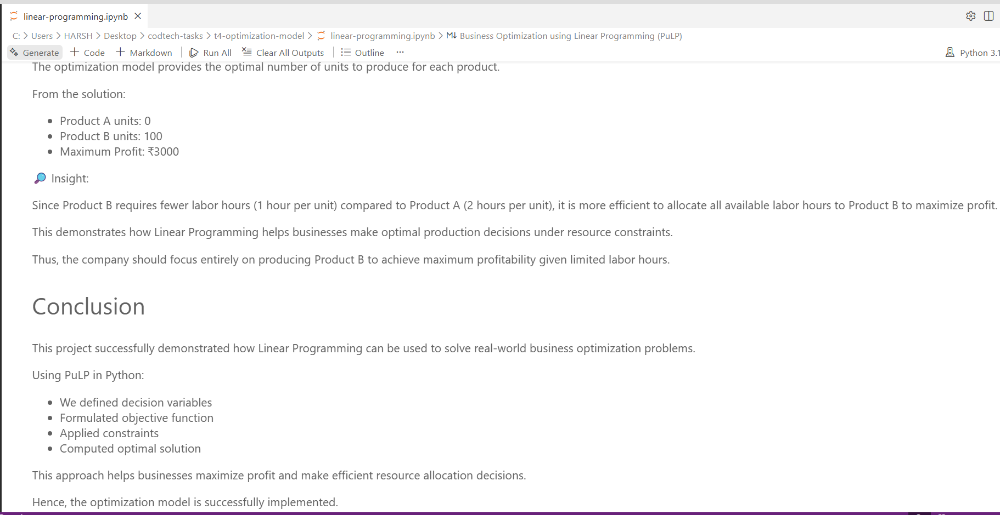

🔹 Task 1 – Data Pipeline Development

Designed and implemented an automated ETL pipeline using Pandas and Scikit-learn to preprocess, clean, transform, and load data efficiently. The pipeline handles missing values, scaling, and feature preparation, ensuring data is ready for analysis or modeling.

Result:

🔹 Task 2 – Deep Learning Project

Developed a deep learning model using TensorFlow/PyTorch for a classification problem. The project includes model training, evaluation, and visualization of performance metrics to analyze accuracy and learning behavior.

Result:

🔹 Task 3 – End-to-End Data Science Project

Built a complete data science solution starting from data collection and preprocessing to model development and deployment using Flask/FastAPI. The project delivers a working API/web app that allows users to interact with the trained model.

Result: 

🔹 Task 4 – Optimization Model

Solved a real-world business optimization problem using Linear Programming with PuLP. Defined decision variables, objective function, and constraints to maximize profit under limited resources.

Result:

